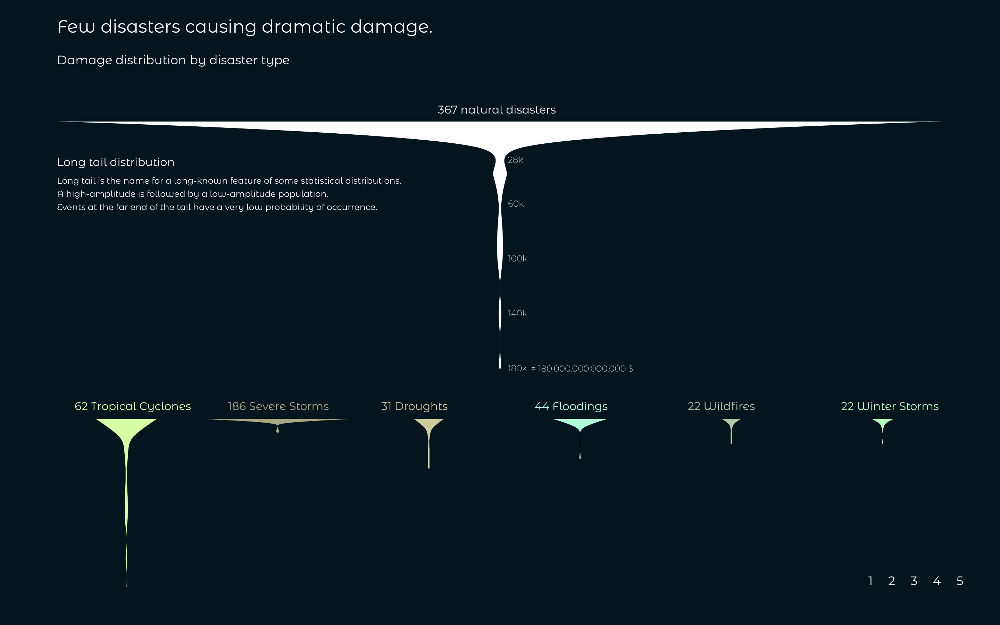
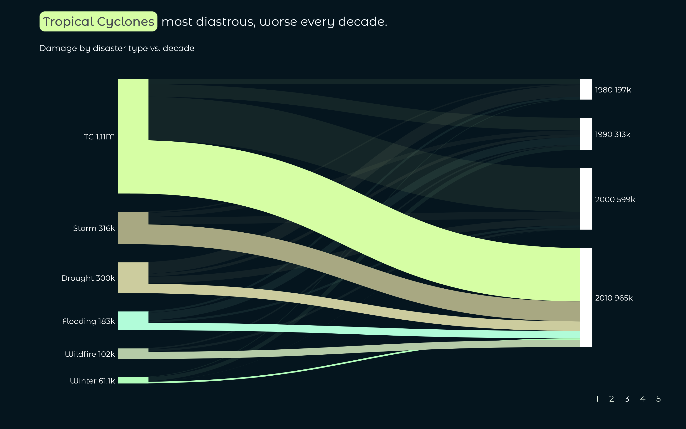
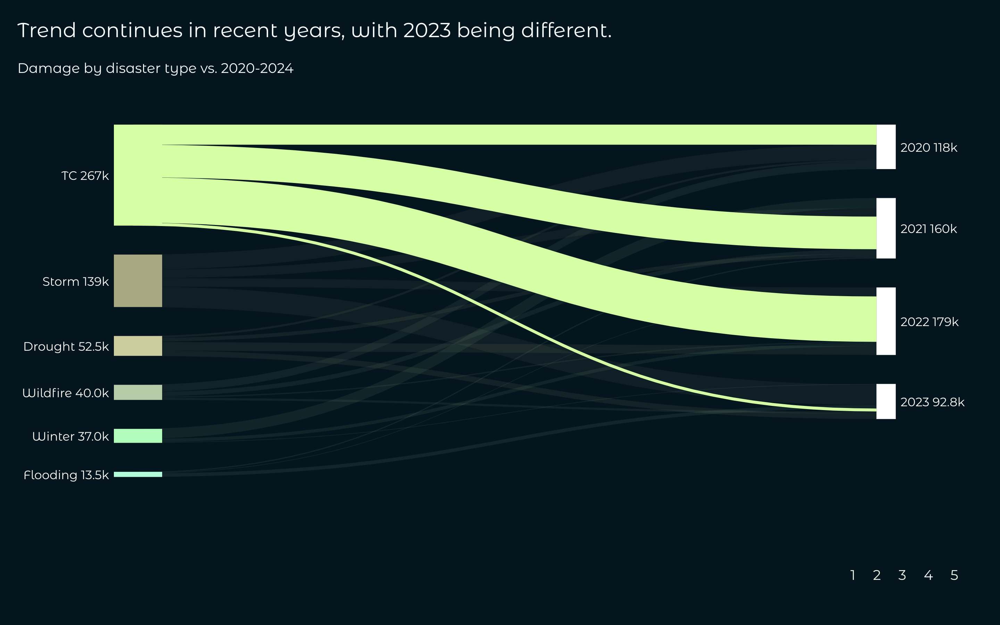
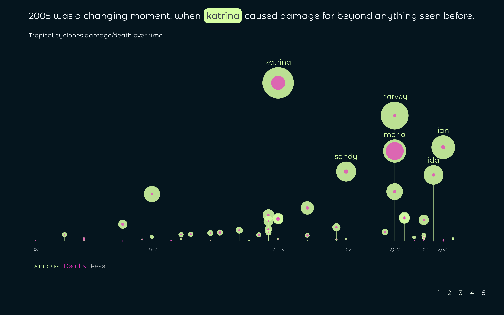

# Billion-dollar-disaster-US

The more time I spend in nature the more fascinated I get with its beauty, wisdom and teachings. It's hard to put into words so I quote Albert Einstein, who said *Look deep into nature, and then you will understand everything better*. 

At the same time climate change is becoming real and threatening all life in this planet. Responding to [Aaron Swartz](https://en.wikipedia.org/wiki/Aaron_Swartz)'s question- *What is the most important thing you could be working on in the world right now? And if you're not working on that, why aren't you?* I believe this is the most important thing right now.  

In this project I analyse deeply the most destructive natural disasters happening in the US over the last decades. The main objective is to understand patterns and possible changes over time providing a sourcefull foundation for discussion or further research. 

On a practical side I showcase the whole process of a data visualisation project using the porgramming language JavaScript for data cleaning, EDA, plotting and the final dynamic visualisation with data provided by [NCEI](https://www.ncei.noaa.gov/access/billions/events/US/1980-2023?disasters[]=all-disasters). 

Have a look at the image below showing a hurricane, one of the most dangerous natural disasters. Some birds though fly directly into the eye of the hurricane, where it is surprisingly clam. 

## 0 EDA

The first step is always to check your data and variable structure as well as general patterns and trends. For this purpose I used [arquero.js](https://uwdata.github.io/arquero/) as a data processing library and [plot.js](https://observablehq.com/plot/) 
 as a plotting library. Please find the whole analysis and finding in this [Observable notebook](https://observablehq.com/@sandraviz/billion-dollar-disasters-arquero-js-plot-js?collection=@sandraviz/billion-dollar-disaster) with a detailed explanation and presentation in this [video](https://www.youtube.com/watch?v=FaoWCGo88ks) 

 # 1 Intro | TweenMax.js

 # 2 Violin chart | d3.js 

 ## 3 Sankey diagram by decade | d3.js 

 After finishing the EDA I wanted to create a compact chart which shows the connection between disaster types and change over type. I choose to aggregate the data on decade level to soften outliers. In the sankey diagram we see two stacked bar charts representing the nodes hence the total damage caused by disaster type on the leftside and by decades on the rigt side. The size of the paths shows how much a specific disaster type contributed to the damage of one specific decade and vice versa. 
 
 Please find a short introduction to this sankey, how to reand and interpret it in this [video](https://www.youtube.com/watch?v=iPAET_ZtVxI) and on how I created the dataset for the sankey in this [video](https://www.youtube.com/watch?v=kFycJtlujEs). If you want to understand the code behind this visualisation please check out the this [video](https://www.youtube.com/watch?v=VV39xSZAJ6c).

 

 ## 4 Sankey diagram recent year | d3.js 

 In this second sankey its all about our current decade and the question where are we heading now? Looking on the first 3 years only we can see that the trend stays the same but everything seems to speed up. 

 

 ## 5 D3.js visualisation | Lollipop chart

Therefore the logic question is so why tropical cyclones are the ones causing this super disasters now. Therefore I filtered only on these ones and chacke now by year how they developed. The main question is, if these aggregated data are mainly based on a few outliers or an actual behaviour change?

 
 

 

