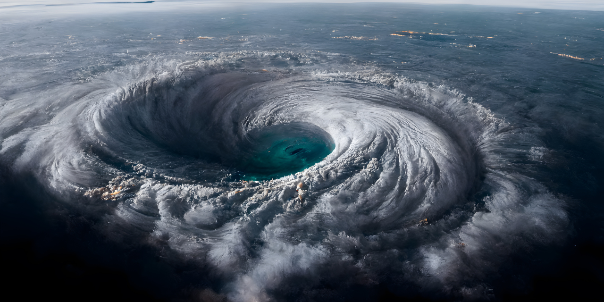
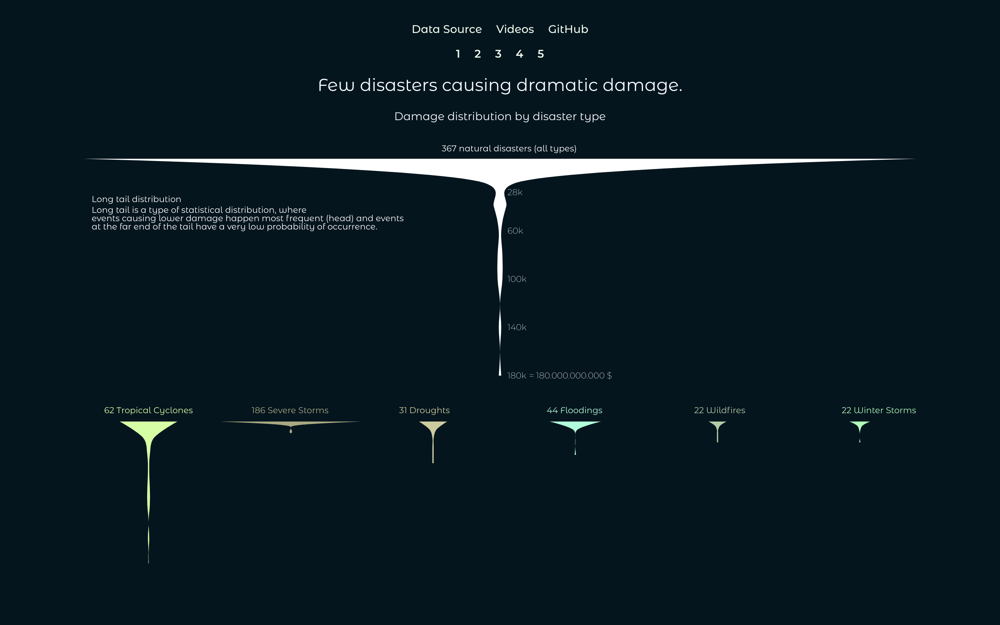
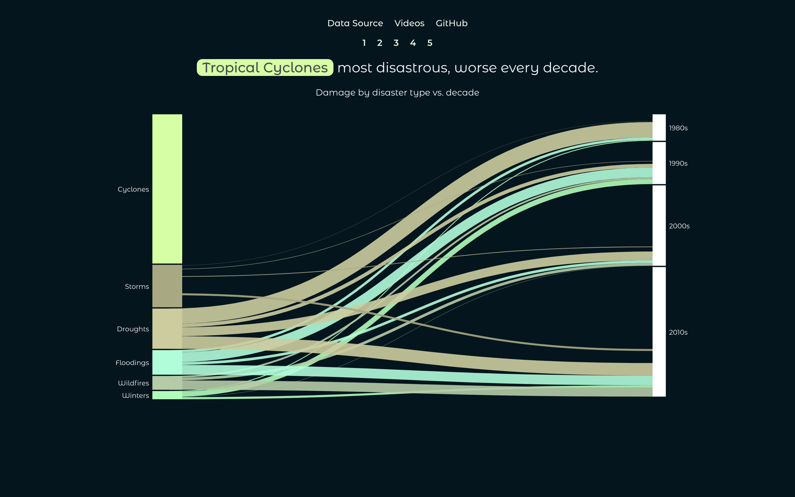
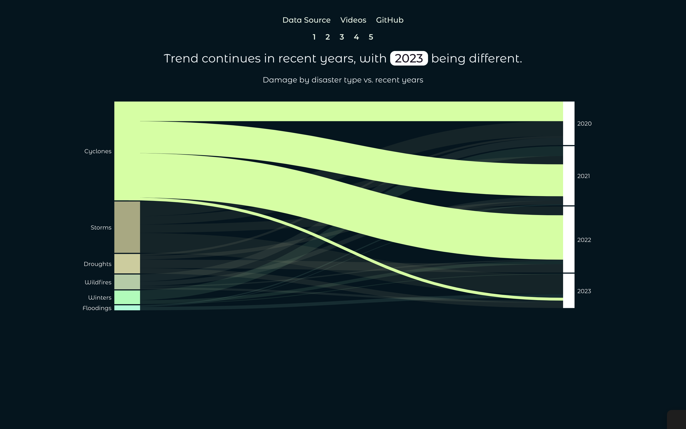

# Natural disasters

A [data visualisation project](https://www.sandraviz.com/natural-disasters) about natural disasters.

## Introduction

The more time I spend in nature the more I am fascinated by its beauty, wisdom and teachings. It's hard to put into words so I quote Albert Einstein, who said _Look deep into nature, and then you will understand everything better_.

At the same time climate change is becoming real and threatening all life on this planet. Responding to [Aaron Swartz](https://en.wikipedia.org/wiki/Aaron_Swartz)'s question _What is the most important thing you could be working on in the world right now? And if you're not working on that, why aren't you?_ I believe this is the most important thing right now.

In this project I analyse deeply the most destructive natural disasters happening in the US over the last decades. The main objective is to understand patterns and possible changes over time providing a resourceful foundation for discussion or further research.

On a practical side I showcase the whole process of a data visualisation project using the programming language JavaScript for [data cleaning](https://observablehq.com/@sandraviz/billion-disasters_data_wrangeling?collection=@sandraviz/natural-disasters), [EDA](https://observablehq.com/@sandraviz/billion-dollar-disasters-arquero-js-plot-js?collection=@sandraviz/billion-dollar-disaster) and the final dynamic visualisation with data provided by [NCEI](https://www.ncei.noaa.gov/access/billions/events/US/1980-2024?disasters[]=all-disasters).

Have a look at the image below showing a hurricane, one of the most dangerous natural disasters. Some birds though fly directly into the eye of the hurricane, where it is surprisingly calm.

## 0 EDA

The first step is always to check your data and variables as well as general patterns and trends. For this purpose I used [arquero.js](https://uwdata.github.io/arquero/) as a data processing library and [plot.js](https://observablehq.com/plot/) as a plotting/charting library. Please find the whole analysis and findings in this [Observable notebook](https://observablehq.com/@sandraviz/billion-dollar-disasters-arquero-js-plot-js?collection=@sandraviz/billion-dollar-disaster).

## 1 Intro | TweenMax.js

It is very important for me to understand the whole situation behind the data I'm working with: what is the so called _human_ factor of the project. In the case of natural disasters it's mass destruction, deaths of humans and nature as well as putting a lot of people in hopeless living situations.

I choose a sequence of three images to transmit the atmosphere in the situation of a natural disaster.

Often satellite images (like the frist one is referring to) are at the warning state of such an event. The second image showing an emergency police car with palms in the background bowing due to intense wind speed is a typical impression of a current natural disaster situation and finally an image of destruction using the color red to further more enhance the dramatic development in more recent years.

Credits to

- [imagesLoaded](https://imagesloaded.desandro.com/) by Dave DeSandro
- [TweenMax](https://gsap.com/resources/3-migration/#loading-plugins) by Greensock
- [TextTrailEffect](https://github.com/codrops/TextTrailEffect) by Manoela Ilic

## 2 Violin chart | d3.js

As every story also this one should start simple. How many disasters happened? What damage is produced on average by one disaster? What are the most extreme disasters and how do those differentiate by type? These are typical questions when thinking about natural disasters.

## 3 Sankey diagram by decade | d3.js

After an introduction to the data by showing the distribution, I wanted to decompose the information on the time axis. For this purpose I created a compact chart which shows the connection between disaster types and change over type. I chose to aggregate data by decade to soften outliers. In the sankey diagram we see two stacked bar charts representing the nodes hence the total damage caused by disaster type on the left side and by decades on the right side. The size of the paths shows how much a specific disaster type contributed to the damage of one specific decade and vice versa.

## 4 Sankey diagram recent years | d3.js

In this second sankey it's all about our current decade and the question where are we heading now? Looking on the first 3 years only we can see that the trend stays the same but everything seems to speed up. In 2023 the pattern has changed, but one year is far too short of a timeframe to indicate a real change happening in the trends. Nevertheless it might be a starting point for further investigation.

## 5 Lollipop chart tropical cyclones over time | d3.js

Therefore the logical question is why tropical cyclones are the ones causing these "super" disasters now. Therefore I filtered only on these ones. Showing frequency, damage dimension as well as relation to death numbers over time reveals more interesting patterns, especially regarding recent years. We can clearly see that since early 2000 disasters have been happening more frequently and create in certain situations huge damage. Even though number of deaths and damage in dollars are kind of related, as both express the intensity of a disaster, we can see in this chart clearly two outliers where the number of deaths was unproportional high.

##

---

Made with :green_heart: by [Sandra](https://www.sandraviz.com)

I am available for freelance data visualization work. Please [contact me](https://www.sandraviz.com/contact) in case you would like me to help you with my experience and expertise or [follow](https://bsky.app/profile/sandraviz.bsky.social) and [connect](https://www.linkedin.com/in/sandradataviz/) with me.
